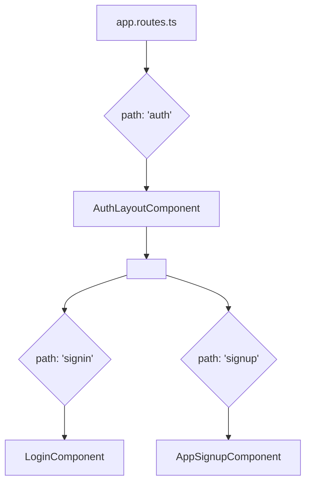

# Authentication Routes Refactoring Plan

This document outlines the plan to refactor the authentication routes in the application.

## Current Situation Analysis

- **Routing:** The authentication routes are currently located under the `auth` path in `src/app/app.routes.ts`. The `signin` and `signup` paths directly load their respective components.
- **Components:**
  - `LoginComponent` in `src/app/login/login.page.ts` handles the logic for the login screen. Its template consists of a single element, `<dc-login />`, which suggests the UI is encapsulated within a library component.
  - `AppSignupComponent` in `src/app/login/signup.component.ts` acts as a wrapper for the `DCSignupComponent` from the `@dataclouder/ngx-auth` library.

## Proposed Refactoring Plan

The plan is to introduce a new layout component that will serve as a parent for all authentication-related pages. This will centralize the layout and simplify the individual login and signup components.

### 1. Create a New `AuthLayoutComponent`

A new standalone component will be created to be responsible for the authentication section's layout.

- **File:** `src/app/auth/auth-layout.component.ts`
- **Template:** This component's template will contain the shared UI elements: the logo, the `<router-outlet>` for child routes, and the version information.

```html
<div class="main-content">
  <div>
    <h1 class="title">
      
    </h1>
  </div>

  <div>
    <router-outlet></router-outlet>
  </div>

  <p class="info-version">{{ envName }} {{ version }}</p>
</div>
```

### 2. Update the Routing Configuration (`app.routes.ts`)

The routes in `src/app/app.routes.ts` will be modified to use the new `AuthLayoutComponent`.

- The route with the `path: 'auth'` will now load `AuthLayoutComponent`.
- The `signin` and `signup` routes will become children of this new parent route, ensuring they are rendered within the `AuthLayoutComponent`'s `<router-outlet>`.

Here is a visual representation of the new routing structure:



### 3. Simplify Existing Components

The existing `LoginComponent` and `AppSignupComponent` will not require any significant changes, as their UI is already provided by the `@dataclouder/ngx-auth` library components. This new structure will simply provide a consistent layout around them.

This approach will result in a cleaner, more maintainable, and better-organized authentication flow.
