# Flow Canvas Services Overview

This document provides a comprehensive guide to the services that power the node-based **Flow Canvas** in Control Markets. These services are organized into layers: **State Management**, **Logic & Utilities**, and **Orchestration**.

---

## 🏗️ Architectural Layers

The architecture follows a reactive pattern using **Angular Signals** for state management and specialized services for different aspects of the flow lifecycle.

```mermaid
graph TD
    UI[Flow Canvas UI] --> Orchestration[FlowOrchestrationService]
    Orchestration --> Logic[Logic & Utilities]
    Orchestration --> State[State Management]
    Logic --> State
    State --> Firestore["🔥 Firestore (Persistence)"]
```

---

## 💾 State Management Services

### [FlowSignalNodeStateService](file:///Users/adamo/Documents/GitHub/control-markets-angular/src/app/pages/flows/services/flow-signal-node-state.service.ts)
The "Source of Truth" for the current flow. It manages the reactive state of nodes and edges.
- **Responsibility**: Adding/removing nodes, creating connections, updating node data.
- **Key Signals**: `nodes`, `edges`, `flow`.

### [FlowExecutionStateService](file:///Users/adamo/Documents/GitHub/control-markets-angular/src/app/pages/flows/services/flow-execution-state.service.ts)
Tracks the real-time execution status of a flow.
- **Responsibility**: Listens to Firestore updates for `flows_execution_state` and updates the UI accordingly.
- **Key Feature**: Detects "Just Completed" jobs to trigger notifications or new node creation.

### [FlowComponentRefStateService](file:///Users/adamo/Documents/GitHub/control-markets-angular/src/app/pages/flows/services/flow-component-ref-state.service.ts)
Maps node IDs to their actual Angular component instances.
- **Responsibility**: Provides a way to access component-specific logic or data that isn't stored in the main state (e.g., temporary UI state).

---

## ⚙️ Logic & Utilities

### [FlowSerializationService](file:///Users/adamo/Documents/GitHub/control-markets-angular/src/app/pages/flows/services/flow-serialization.service.ts)
Handles the conversion between the live canvas state and the persistable database format.
- **Responsibility**: `serializeFlow()` for saving and `loadFlow()` for restoring.

### [FlowNodeRegisterService](file:///Users/adamo/Documents/GitHub/control-markets-angular/src/app/pages/flows/services/flow-node-register.service.ts)
A registry that maps string identifiers to Angular component types.
- **Responsibility**: Decouples the storage format (strings) from the implementation (types).

### [FlowNodeCreationService](file:///Users/adamo/Documents/GitHub/control-markets-angular/src/app/pages/flows/services/flow-node-creation.service.ts)
Logic for instantiating specific types of nodes based on business rules.
- **Responsibility**: Creating "Asset Generated" nodes or "Audio TTS" nodes automatically.

### [NodeSearchesService](file:///Users/adamo/Documents/GitHub/control-markets-angular/src/app/pages/flows/services/node-searches.service.ts)
Utilities for traversing the flow graph.
- **Responsibility**: Finding input nodes, output nodes, or nodes of a specific type connected to a target.

### [NodePromptBuilderService](file:///Users/adamo/Documents/GitHub/control-markets-angular/src/app/pages/flows/services/node-prompt-builder.services.ts)
Aggregates logic for constructing AI prompts based on the connected nodes.
- **Responsibility**: Building context from source nodes and extracting personas from agent cards.

---

## 🚀 Orchestration & Facade

### [FlowOrchestrationService](file:///Users/adamo/Documents/GitHub/control-markets-angular/src/app/pages/flows/services/flow-orchestration.service.ts)
The primary API used by the UI to interact with the flow system.
- **Responsibility**: Saving flows, running executions (`runFlow`, `runNode`), and loading initial data.

### [FlowDiagramStateService](file:///Users/adamo/Documents/GitHub/control-markets-angular/src/app/pages/flows/services/flow-diagram-state.service.ts)
A facade that simplifies access to the core signal state and the `vflow` component.
- **Responsibility**: Provides a cleaner interface for common canvas operations.

---

## 🔄 Common Workflows

### Saving a Flow
1. UI calls `FlowOrchestrationService.saveFlow()`.
2. `FlowSerializationService` gathers data from `FlowSignalNodeStateService`.
3. The serialized JSON is sent to `FlowService` (Backend API).

### Running a Node
1. UI calls `FlowOrchestrationService.runNode()`.
2. The current flow is saved.
3. The backend is triggered to execute the specific node.
4. `FlowExecutionStateService` starts listening for Firestore updates to show progress.
