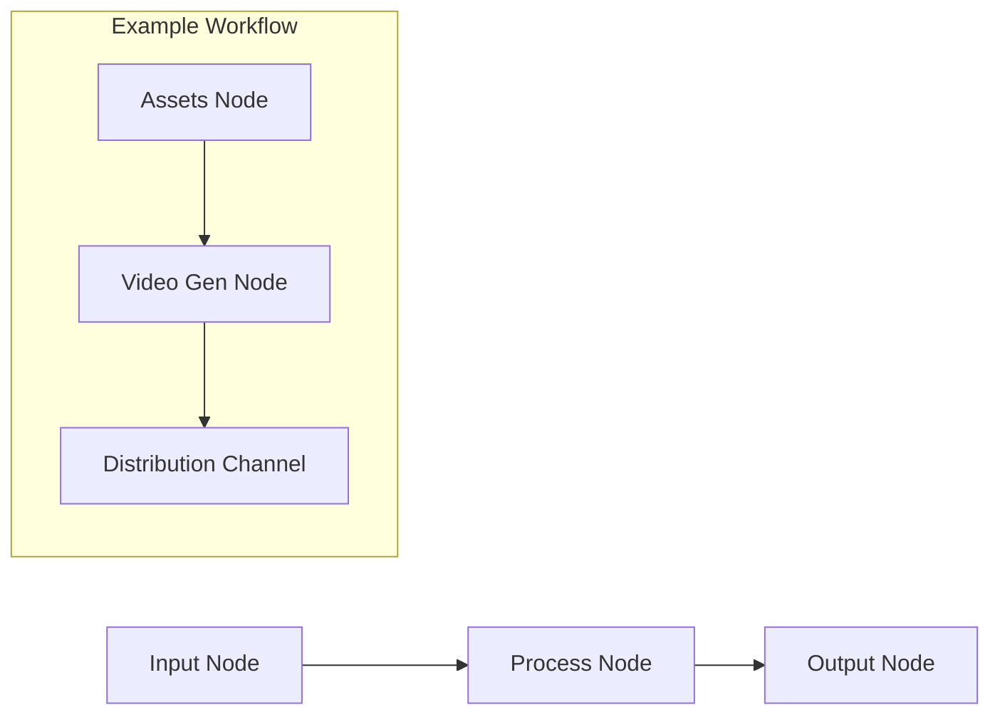

# Control Markets Documentation

Welcome to the official documentation for **Control Markets**, a node-based platform designed for automating marketing and sales tasks using a **Cluster Architecture** of AI agents.

## 🚀 Overview

Control Markets provides a visual, canvas-based dashboard where you can orchestrate complex workflows by connecting different types of nodes. Unlike simple chatbots, these agents can embody specific personas, psychological profiles, and communication patterns.

### Cluster Architecture

The system operates on a cluster architecture where nodes are categorized into three primary types:

1.  **Inputs**: Data sources, files, or triggers that feed into the flow.
2.  **Process**: Nodes that transform or operate on data (e.g., AI agents, video generators).
3.  **Outputs**: The result of the flow (e.g., generated assets, distribution channels).

---

## 🏗️ Core Documentation

Explore the technical and structural details of the system:

*   **[Project Architecture](file:///Users/adamo/Documents/GitHub/control-markets-angular/docs/architecture.md)**: High-level overview of the tech stack (Angular, Ionic, Firebase) and project structure.
*   **[Flow Serialization Plan](file:///Users/adamo/Documents/GitHub/control-markets-angular/docs/flow-serialization-plan.md)**: Details on how canvas graphs are saved and loaded from the database.
*   **[Job Completion Flow](file:///Users/adamo/Documents/GitHub/control-markets-angular/docs/flow-job-completion-plan.md)**: Technical plan for tracking execution state of flows.
*   **[Technical Details](file:///Users/adamo/Documents/GitHub/control-markets-angular/docs/technical_details.md)**: Deep dive into specific implementations.
*   **[Node UI Architecture](file:///Users/adamo/Documents/GitHub/control-markets-angular/docs/node-architecture-ui.md)**: Explanation of the dual-layer (Canvas vs. Popups) interface and the **Wrapper Node mechanism** for standardized implementation.
*   **[Flow Services Overview](file:///Users/adamo/Documents/GitHub/control-markets-angular/docs/flow-services-overview.md)**: Detailed guide to the services powering the flow canvas.

---

## 🧩 Node Reference

The system supports various specialized nodes (defined in [flows.model.ts](file:///Users/adamo/Documents/GitHub/control-markets-angular/src/app/pages/flows/models/flows.model.ts)):

| Node Type | Category | Description |
| :--- | :--- | :--- |
| `AgentNode` | Process | Persona-based AI agent that executes tasks. |
| `TaskNode` | Process | Specific LLM-driven instruction or action. |
| `AssetsNode` | Input | Container for static assets (Images, Documents). |
| `VideoGenNode` | Process | Automates video generation from connected assets. |
| `OutcomeNode` | Output | Final result or data capture point. |
| `LeadNode` | Output/Input | Management of marketing leads. |
| `DistributionChanel` | Output | Publishes content to social networks or platforms. |

---

## 🛠️ Developer Guides

*   **[Creating a New Node](file:///Users/adamo/Documents/GitHub/control-markets-angular/docs/creating-new-node.md)**: Step-by-step guide to extending the canvas with custom nodes.
*   **[Starting Ionic](file:///Users/adamo/Documents/GitHub/control-markets-angular/docs/starting-ionic.md)**: Quick start for Ionic and Angular standalone components.

---

## 🗺️ Roadmap & Planning

*   **[Auth Refactoring](file:///Users/adamo/Documents/GitHub/control-markets-angular/docs/auth-refactoring-plan.md)**: Ongoing plan for improving authentication mechanisms.
*   **[PWA Summary](file:///Users/adamo/Documents/GitHub/control-markets-angular/docs/PWA_SUMMARY.md)**: Strategies for Progressive Web App deployment.
