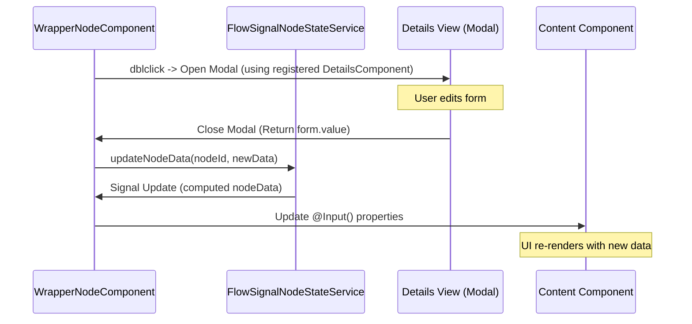

# Node-Details Communication Standard

This document defines the standard pattern for communication between a flow node (on the canvas) and its detailed configuration view (the popup dialog).

---

## 🔄 The Centralized Pattern

In the refined architecture, the communication and state management logic are centralized in the `WrapperNodeComponent`. Individual content components remain pure views that receive data via `@Input()` properties.



---

## 1. Registration

To enable a details modal for a node, you must register the `detailsComponent` in the `FlowNodeRegisterService`.

**File**: [flow-node-register.service.ts](file:///Users/adamo/Documents/GitHub/control-markets-angular/src/app/pages/flows/services/flow-node-register.service.ts)

```typescript
this.nodeConfigMap.set({
  [NodeCompTypeStr.MyNode]: {
    component: MyContentComponent,
    detailsComponent: MyDetailsComponent, // 👈 Register here
    category: NodeCategory.INPUT,
    color: '#...',
    icon: 'pi pi-...',
    label: 'My Node'
  },
});

// These registered values populate the 'config' field automatically.
```

---

## 2. The Content Component (Pure View)

Content components should be simple. They don't need to extend `BaseFlowNode` or inject services for communication.

```typescript
@Component({
  selector: 'app-my-content',
  template: `<div>{{ myField }}</div>`,
  standalone: true
})
export class MyContentComponent {
  @Input() myField: string = ''; // 👈 Bound automatically by Wrapper
}
```

---

## 3. The Details View (Configuration)

The details component handles the UI for configuration and returns updated data.

### Configuration
1. **Inject `DynamicDialogRef` and `DynamicDialogConfig`**.
2. **Use Reactive Forms** for managing state.

### Implementation Example
```typescript
export class MyDetailsComponent implements OnInit {
  public form!: FormGroup;
  public node: any;

  constructor(
    public ref: DynamicDialogRef,
    public config: DynamicDialogConfig,
    private fb: FormBuilder
  ) {}

  ngOnInit() {
    this.node = this.config.data; // 👈 Receive the full node
    this.initForm();
  }

  private initForm() {
    // node.data contains both 'config' (metadata) and 'nodeData' (business data)
    const nodeData = this.node?.data?.nodeData;
    this.form = this.fb.group({
      myField: [nodeData?.myField || ''],
    });
  }

  public save() {
    if (this.form.valid) {
      this.ref.close(this.form.value); // 👈 Return data on close
    }
  }
}
```

---

## 💡 Benefits of this Standard

1.  **Extreme Decoupling**: Content components are just views. They don't care how or where data is saved.
2.  **Consistency**: No more duplicate `openModal` logic scattered across dozens of files.
3.  **Stability**: High-level orchestration (handles, toolbars, modal lifecycle) is managed in a single, well-tested location: `WrapperNodeComponent`.
