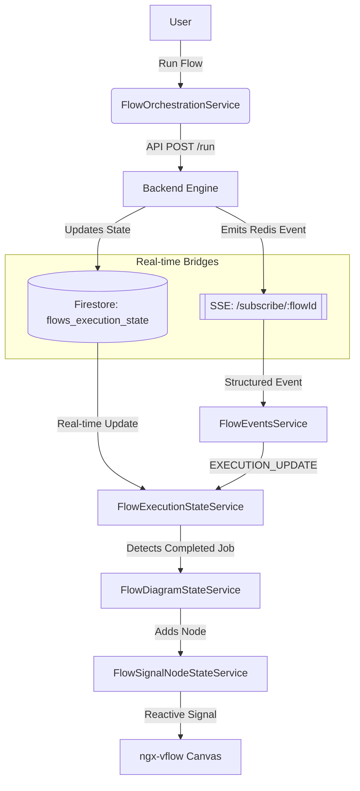

# Frontend Event Synchronization

This document explains how the frontend stays in sync with the backend during flow execution. Currently, the system supports dual synchronization via **Firebase/Firestore** and **Server-Sent Events (SSE)**.

## Architecture Overview

The synchronization mechanism allows the frontend to react in real-time to changes in the execution state produced by the backend.

## Key Services

### 1. `FlowService`
Responsibility: Standard HTTP communication with the backend.
- `runFlow(id)`: Triggers the execution of a complete flow.
- `runNode(flowId, nodeId)`: Triggers the execution of a specific task node.

### 2. `FlowOrchestrationService`
Responsibility: Coordination between serialization, saving, and execution.
- Ensures the flow is saved before execution.
- **Initializes both listeners**:
    - `FlowExecutionStateService.initializeExecutionStateListener(executionId)` (Firestore).
    - `FlowEventsService.subscribeToFlow(flowId)` (SSE).

### 3. `FlowExecutionStateService`
Responsibility: The core synchronization hub.
- **Firebase Listener**: Uses `@angular/fire/firestore` to subscribe to the document `flows_execution_state/${executionId}`.
- **State Management**: Maintains a `flowExecutionState` signal containing the full execution tree.
- **Node Triggering**: When a job is newly completed (detected via `updateJobNodes()`), it adds the corresponding results to the canvas.

### 4. `FlowEventsService` [NEW]
Responsibility: Handling SSE streams for real-time updates.
- **SSE Subscription**: Connects to `GET /api/creative-flowboard/subscribe/:flowId`.
- **Event Handling**: 
    - The service is designed to be flexible and supports two data formats from the SSE stream:
        1. **Wrapped Event (`IFlowEvent`)**: A structured object with `event` (type) and `payload` fields. Supported events include `EXECUTION_UPDATE` and `SYNC_CANVAS`.
        2. **Direct State (`IFlowExecutionState`)**: If the incoming data contains a `tasks` property, it is treated directly as a flow execution state update and passed to `FlowExecutionStateService`.
    - `EXECUTION_UPDATE`: Updates `FlowExecutionStateService` with the new state and triggers UI updates.
    - `SYNC_CANVAS`: (Planned) Direct synchronization of node positions and canvas state.
    - `LOG_STREAM`: (Planned) Partial results and streaming AI output.

### 5. `FlowSignalNodeStateService`
Responsibility: Managing the reactive state of the canvas via `nodes` and `edges` signals.

## Why Both?

The system currently runs both listeners to ensure maximum reliability during the transition period.
- **Firebase**: Provides a persistent, globally accessible state mirror.
- **SSE**: Offers lower-latency, infrastructure-independent events (backed by Redis internally).

The backend determines which mechanism to use for emitting updates, and the frontend is prepared to handle both. SSE events for `EXECUTION_UPDATE` are automatically piped into the same processing logic as Firestore updates to maintain consistency.
