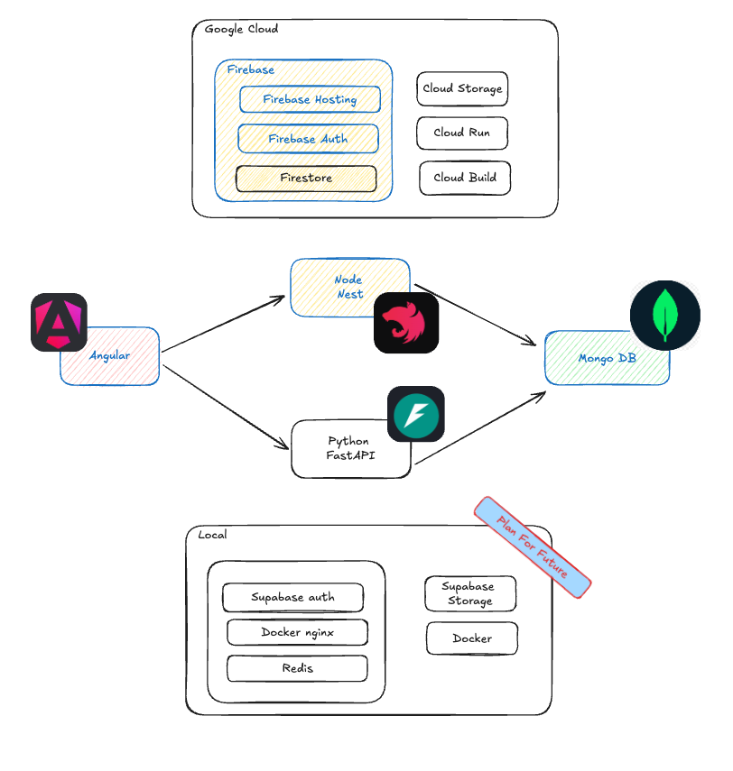

https://coolors.co/2d0c62-74fac9-7fd6d2-5cbae7-3677bd

# 🌩 Control Markets

> ⚠️ **Note**: This project is currently under development in alpha version and may contain bugs.

## ⚡ TLDR;

The whole project aims is to create startup quickly, consist in multiple templates ready to use. For now uses google cloud as cloud provider,

This repository contains the ionic/angular template.

Run these commands to get started quickly:

```bash
# 1. Clone the repository (replace 'your-project-directory' with your desired directory name)
git clone https://github.com/adamofig/control-markets-angular.git

# 2. Run the setup script will ask you for a name to rename the project.
node scripts/setup_project.js

# 3. Deploy to Firebase
make deploy

```

Then understand architecture and install backend in the other repository.



## ✨ Features

- 🔐 Firebase Authentication
- 🔑 Google, Apple, Email/Password Sign In
- 📱 Mobile Support (Android, iOS)
- 🌐 Web Support
- ⚡ Backend Support (Nest.js, FastAPI)
- 🔄 CI/CD Automation (Google Cloud Build)
- 🎯 And more...

## �� Configuration

### 🔥 Firebase Setup Manually

if you already have a firebase project, you can skip the auto setup and do it manually.

1. Create a new Firebase project (or use existing)
2. Copy Firebase credentials to `environment.ts`
3. Enable Authentication methods:

   - Navigate to Firebase Console → Authentication
   - Enable Email/Password and Google sign-in
   - Add authorized domains (localhost is included by default)

### Change the Firebase credentials.

Get credentials from the Firebase console (create a new project if you don't have one). Copy and paste the credentials in the environment.ts.

That's all at this point. You should be able to run the app and be able to sign up using email or Google.

    npm run start

### Add storage to Firebase.

- You need to change the project to Firebase Blaze and add a billing account.
- Initialize Storage in the console and set rules (testing rules to start).

### Change Android and iOS IDs. Future work...

    Android (Pending)

* build.gradle
* strings.xml
* MainActivity.java -> This concerns me as it is a package name.

    iOS

* project.pbxproj
* Info.plist

2. Add Firebase variables in the environment.ts. Make sure your app is set with permissions to localhost.

- Go to Firebase Authentication https://console.firebase.google.com/project/[your-project]/authentication
- Add email authentication, add Google authentication
- Check authorized domains, by default it is localhost.
- Go to project settings -> your apps and create a new app or get the Firebase data if you already have it. Save this data in environment.ts.
- Done. Sign in and verify at https://console.firebase.google.com/project/[your-project]/authentication/users that you have your new user.

3. Publish the web app.

- Enable hosting at https://console.firebase.google.com/project/[your-project]/apphosting
- npm install -g firebase-tools

  firebase init hosting --project control-markets-pro Answer the questions directory -> www, single-page app: y -> GitHub no -> override yes

  This is just to get the firebase.json and .firebaserc files (you can also copy them).

## Run the project

```bash

    npm run install or make init-firebase
    npm run start or make start
```

Note: you need to set backend in environment.ts in order to connect with methods. check projects.

https://github.com/adamofig/dataclouder-template-node https://github.com/adamofig/dataclouder-python-template

## Deploy to firebase

### Manual deploy

```bash
    npm run build
    firebase deploy --only hosting:control-markets-pro
    firebase deploy --only hosting:control-markets-dev : change .firebaserc to control-markets-dev
```

#### deploy using make

    make deploy

### Automatic deploy

Pending... connect with Google Cloud Trigger.s

# 4) Add Android

1) To avoid delaying other steps, it is best to create your certificate right away.

   * Reasons: It is required for publication and for multiple environments to work.
   * It is required for Google login.
1) Create keystore.

   * Navigate to the android folder. cd android/app
   * keytool -genkey -v -keystore control-markets.keystore -alias pro -keyalg RSA -keysize 2048 -validity 10000
   * Prepare to answer:

       name: jordan

       unit: dev

       organization: control-markets

       city: cdmx

       province: cdmx

       country code: mx

       confirm: y
   * Optional: Create a second key for another environment for greater security, or use the same one for speed and convenience.

    keytool -genkey -v -keystore control-markets.keystore -alias dev -keyalg RSA -keysize 2048 -validity 10000

    pass: Hola1234
1) Obtain the corresponding certificates and save them in the credentials.

    keytool -list -v -keystore control-markets.keystore

* Go to Google Cloud Console, https://console.cloud.google.com/apis/credentials?project=[your-project], you will see a default Firebase one used by the web.
* Create an Android client -> Create OAuth client ID
* Create an Android certificate.
* (Optional) Add the consent screen.
* Select your universal ID dev.control-markets.template.

4) Add Android to the project (ionic add android is already done but only to compare file changes) or make file configurations.

   * Build Gradle is already prepared, change the variables and environment names / TODO: See if I can change the variables.
   * Modify the main project files.
   * Run the project and test Google authentication.

# Add iOS

1) Create the iOS authentication credential.
2) Extract the client ID and reverse client ID data in the Additional Information section.

    TODO: Understand how to extract the developer team, script to change the developer team 97TH9F3GM9.

    From the interface, I set it as a variable $(REVERSED_CLIENT_ID) but here you just need to add the data to the configuration files.

    From the interface, I created the configuration files to modify the pbxproj.

## 🚀 Development

Start the development server:

```bash
npm run start
```

### Start a new component.

In the future i'll create a script to do this.

1. Generante in app/pages
2. Most likely create a service. 2.1) Select and icon https://ionic.io/ionicons and get only the name, app will adjust depending platform.
3. Go to Ionic-Layout.component.html and change the bottom tool, this shows at the buttom.
4. Go to ionic-layout.component.ts and appPages this shows in the left menu.

## 📄 License

### Backend

This project also comes with ready to use backend in Nest.js and Python FastAPI.

-> https://github.com/adamofig/dataclouder-python-template

-> https://github.com/adamofig/dataclouder-template-node

## 2) Automate the deployment to Google Cloud CI/CD

Very easy step if you want to automate the deployment on Google Cloud.

#### 1) Create a new project in Google Cloud.

Or use the existing one.

#### 3) Add the secrets for environments ts or upload your environment to your source code if project is private needs to be called, 'environment_secret'

- Add permissions to the service account -> Secret Manager Secret Accessor

#### 4) Create new trigger pointing to the branch you want to deploy.

- create a varible for yaml building script usualy \_ENV = dev or \_ENV = pro.
- this script is the one used in package.json build:dev

#### 5) Create firebase docker images to compile as intermediate steps.

follow instructions here: https://cloud.google.com/build/docs/deploying-builds/deploy-firebase is basically create image container that is able to compile the project, the important commands are:

```bash
# clone the repository
git clone https://github.com/GoogleCloudPlatform/cloud-builders-community.git
cd cloud-builders-community/firebase
# build the image and upload to artifact registry
gcloud builds submit .
```

### About the theme and palete.

### What do you need to know to change the palete?

the project uses primeng and ionic. so you need to change both.

Check documentation: https://ionicframework.com/docs/theming/colors https://primeng.org/theming

Quick intro:

