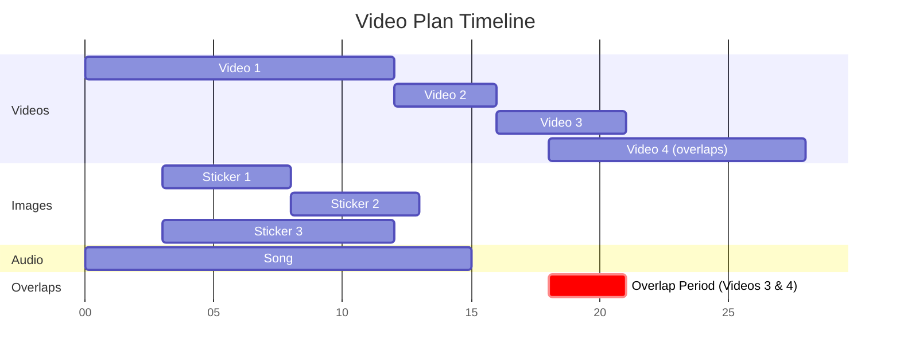

```mermaid
gantt
    title Video Plan Timeline
    dateFormat s
    axisFormat %S

    section Videos
    Video 1           :v1, 0, 12s
    Video 2           :v2, after v1, 4s
    Video 3           :v3, after v2, 5s
    Video 4 (overlaps):v4, 18, 10s


    section Images
    Sticker 1     :s1, 3, 5s
    Sticker 2     :s2, after s1, 5s
    Sticker 3     :s3, 3, 9s

    section Audio
    Song    :a1, 0, 15s

    section Overlaps
    Overlap Period (Videos 3 & 4)    :crit, 18, 3s
```
